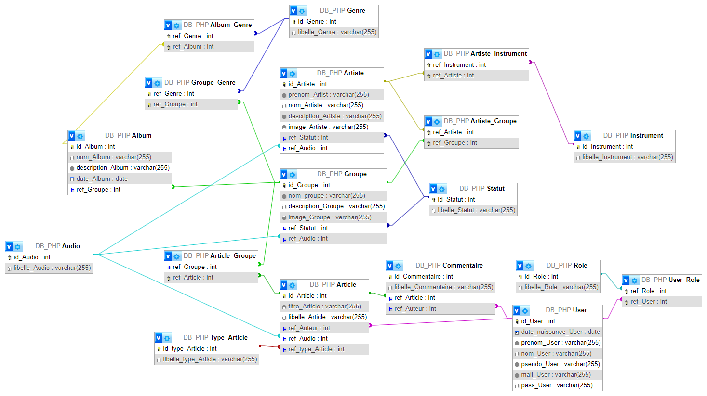

# SiteMetal

Projet de gestions d'articles sur le métal en général

  - ## Installation
  
    - ### Lancement des conteneurs docker
  
      `docker compose up -d`
  
    - ### Création de la base de données
  
      `docker exec -it sitemetal_mysql mysql -u root -proot -e 'CREATE DATABASE DB_PHP;'`
  
    - ### Lancement du script pour charger le schéma de base de données

      `docker exec -it sitemetal_mysql bash -c 'mysql -u root -proot DB_PHP < /DB_PHP.sql'`

  - ## Description

    [//]: # (TODO : Description)
    - Ce projet permet de voir une collection d'articles enregistrés dans une base de données.
      Il faut se connecter ou créer un compte pour avoir accès au détail de l'article.

- ## MVC

  - ### Modèle

    [//]: # (TODO : Model)
    

  - ### Vue

    - Gestion des vues en HTML avec du style CSS et un peu de JavaScript pour les alertes.

    - Utilisation de Components, morceaux d'HTML pouvant être utilisés sur plusieurs vues.

  - ### Contrôleur

    - Utilisation d'un fichier **.htaccess** pour faire passer toutes les requêtes par index.php

    [//]: # (TODO : Controller)